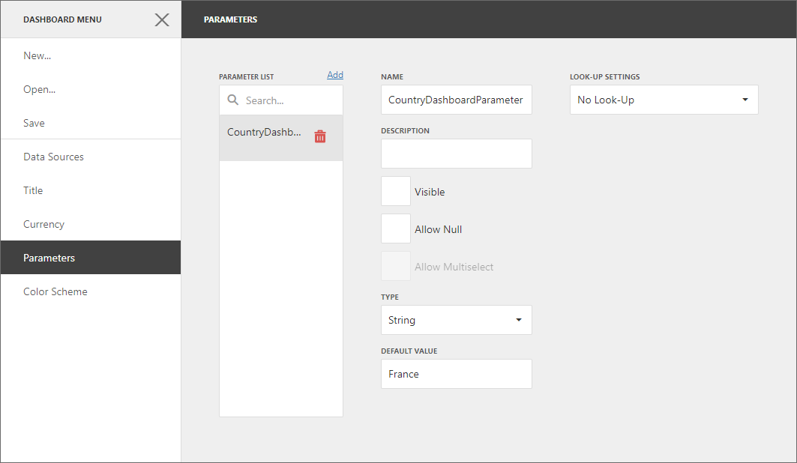
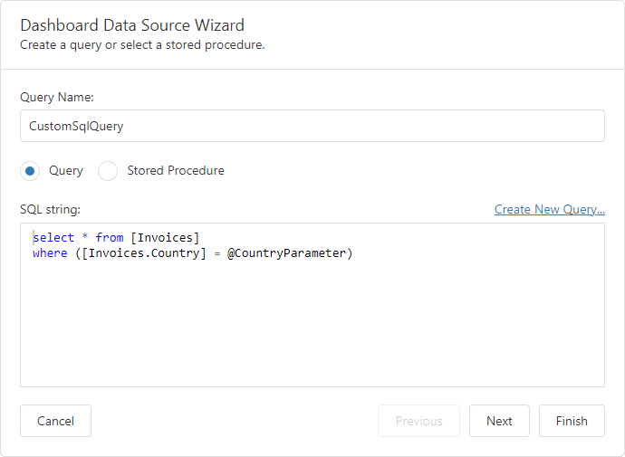
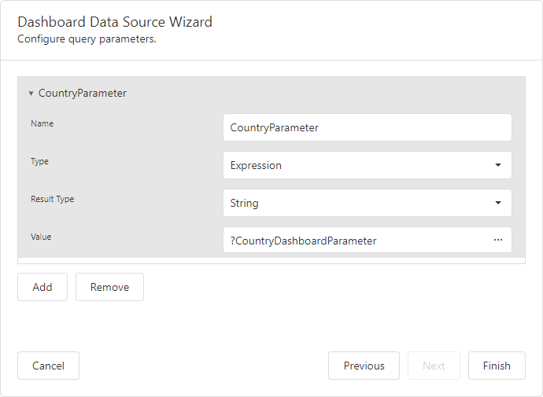

<!-- default badges list -->

<!-- default badges end -->
# Dashboard for Web Forms - How to pass a hidden dashboard parameter to a custom SQL query

This example shows how to pass a hidden [dashboard parameter](https://docs.devexpress.com/Dashboard/117062) to a [custom SQL query](https://docs.devexpress.com/Dashboard/117193). In this example, the [ASPxDashboard.CustomParameters](https://docs.devexpress.com/Dashboard/DevExpress.DashboardWeb.ASPxDashboard.CustomParameters) event is handled to change the dashboard parameter's default value before it is passed to the query.

> **Warning**:
> A user can get sensitive information from dashboard parameters. Encode the passed parameter value if possible. Do not store any sensitive information in dashboard parameters that isn't encrypted.

## Example Overview

To pass a hidden dashboard parameter to a custom SQL query, do the following.

### Create a Dashboard Parameter

To [create a dashboard parameter](https://docs.devexpress.com/Dashboard/117547), open the [dashboard menu](https://docs.devexpress.com/Dashboard/117444) and go to the **Parameters** section. In this section, create a parameter and specify its settings. Disable the [*Visible*](https://docs.devexpress.com/Dashboard/js-DevExpress.Dashboard.Model.Parameter#js_devexpress_dashboard_model_parameter_parametervisible) checkbox to hide the parameter from users in Viewer mode. In this example, the dashboard parameter's name is **CountryDashboardParameter** and its default value is _France_:

### Create a Custom Query

Set the [`ASPxDashboard.AllowExecutingCustomSql`](https://docs.devexpress.com/Dashboard/DevExpress.DashboardWeb.ASPxDashboard.AllowExecutingCustomSql) property to `true` to allow custom SQL query execution on the server. To allow users to edit a custom SQL string in the SQL String editor, set the [`ASPxDashboard.EnableCustomSql`](https://docs.devexpress.com/Dashboard/DevExpress.DashboardWeb.ASPxDashboard.EnableCustomSql) property ro `true`. 

> **Warning**:
> The use of custom SQL queries can lead to inadvertent or unauthorized modifications to your data/database structure. Ensure that you follow best practices and implement the appropriate user read/write privileges at database level.

You can see the query specified for the data source in the [Data Source Wizard](https://docs.devexpress.com/Dashboard/117680):
 

This query contains a query parameter named **CountryParameter**. 

### Bind the Query Parameter to the Dashboard Parameter

To be able to change the query parameter's value, bind it to the **CountryDashboardParameter** dashboard parameter. To do this, on the second page of the Data Source Wizard set the parameter's type to *Expression* and specify the corresponding dashboard parameter in the *Value* field.

### Change the Default Parameter Value in Code

Handle the [`ASPxDashboard.CustomParameters`](https://docs.devexpress.com/Dashboard/DevExpress.DashboardWeb.ASPxDashboard.CustomParameters) event and specify the default value: [WebForm1.aspx.cs](./CS/ASPxDashboard_CustomParameters/WebForm1.aspx.cs) (VB: [WebForm1.aspx.vb](./VB/ASPxDashboard_CustomParameters/WebForm1.aspx.vb)).

As the result, a user see a dashboard based on the data from the SQL query with the **CountryParameter** query parameter's value specified in the `ASPxDashboard.CustomParameters` event handler (_Brazil_).

## Files to Review

- [WebForm1.aspx.cs](./CS/ASPxDashboard_CustomParameters/WebForm1.aspx.cs) (VB: [WebForm1.aspx.vb](./VB/ASPxDashboard_CustomParameters/WebForm1.aspx.vb))
- [WebForm1.aspx](./CS/ASPxDashboard_CustomParameters/WebForm1.aspx#L17-L18) (VB: [WebForm1.aspx](./VB/ASPxDashboard_CustomParameters/WebForm1.aspx#L17-L18))

## Documentation

- [Dashboard Parameters](https://docs.devexpress.com/Dashboard/117062/web-dashboard/create-dashboards-on-the-web/data-analysis/dashboard-parameters)
- [Query Parameters](https://docs.devexpress.com/Dashboard/117192/web-dashboard/create-dashboards-on-the-web/providing-data/working-with-sql-data-sources/pass-query-parameters)
- [Custom SQL Queries](https://docs.devexpress.com/Dashboard/117193/web-dashboard/create-dashboards-on-the-web/providing-data/working-with-sql-data-sources/custom-sql-queries)

## More Examples

- [Dashboard for ASP.NET Core - How to pass a hidden dashboard parameter to a custom SQL query](https://github.com/DevExpress-Examples/asp-net-core-dashboard-pass-hidden-parameters-to-custom-sql-query)
- [Dashboard for Web Forms - How to specify dashboard parameter values on the client side](https://github.com/DevExpress-Examples/aspxdashboard-how-to-specify-dashboard-parameter-values-on-the-client-side-t495684)
- [Dashboard for Web Forms - How to update the parameter value when the item's master filter state is changed](https://github.com/DevExpress-Examples/how-to-update-the-parameter-value-when-the-items-master-filter-state-is-changed-t575012)
